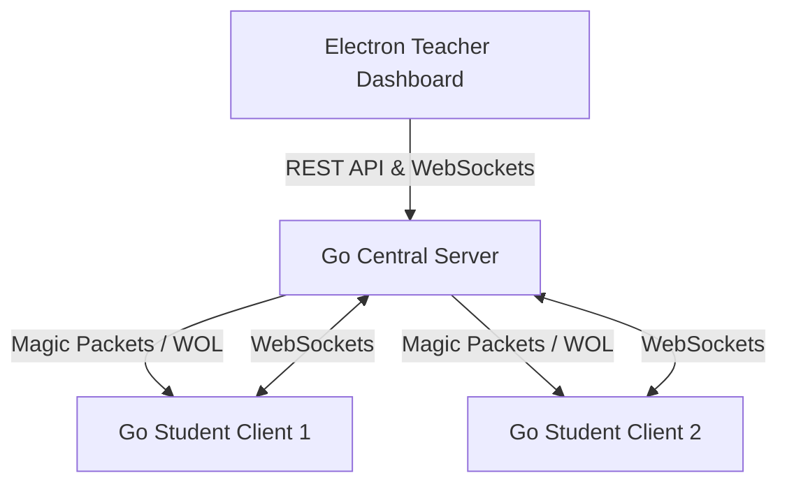

<p align="center">
  
</p>

<h1 align="center">🎓 PolyOS Lab</h1>

<p align="center">
  <strong>Eğitim kurumları ve bilgisayar laboratuvarları için modern, güvenli ve anlık yönetim ekosistemi.</strong>
</p>

<p align="center">
  
  
  
</p>

<p align="center">
  
  
  
  
  
  
</p>

<p align="center">
  
  
  
  
  
</p>

<p align="center">
  <a href="#-nedir">Nedir?</a> •
  <a href="#-özellikler">Özellikler</a> •
  <a href="#-mimari-ve-yapı">Mimari Yapı</a> •
  <a href="#-kurulum">Kurulum</a> •
  <a href="#-yol-haritası">Yol Haritası</a> •
  <a href="#-lisans">Lisans</a>
</p>

---

## 🌟 Nedir?

**PolyOS Lab**, okul laboratuvarlarında öğretmenlerin öğrenci bilgisayarlarını canlı olarak izlemesini, kontrol etmesini ve yönetmesini sağlayan modern, yüksek performanslı ve hafif bir laboratuvar yönetim ekosistemidir. 

Geleneksel ağır ve hantal yönetim araçlarının aksine, Go dilinin sunduğu yerel hız ve eşzamanlılık (concurrency) avantajları ile React/Vite/Electron üçlüsünün esnek arayüz dinamiklerini birleştirir. Özellikle **Pardus (Linux)** işletim sistemine tam uyum sağlamakla birlikte **macOS** üzerinde de simülasyon/geliştirme desteği sunar.

---

## 🚀 Özellikler

### 🖥️ Ekran İzleme ve Uzaktan Kontrol
* **Düşük Gecikmeli Canlı Yayın**: İstemcilerden sunucuya 2 saniyede bir (uzaktan kontrolde 100ms) optimize edilmiş ekran görüntüleri akar.
* **Fare ve Klavye Simülasyonu**: Tek tıklamayla uzak makinedeki fare koordinatlarını yüzdesel olarak hesaplar ve `xdotool`/CoreGraphics aracılığıyla anında simüle eder.
* **Pano (Clipboard) Senkronizasyonu**: Öğretmen panosundaki herhangi bir metni anında öğrenci bilgisayarının kopyalama hafızasına gönderir.

### 🔒 Güvenlik ve Odak Modu
* **Girdileri Kapat & Kilitle**: Tek tıkla tüm klavye/fare girdilerini `xinput` seviyesinde kapatır ve Tkinter tabanlı aşılması imkansız, tam ekran bir *"Bu Bilgisayar Kilitlendi"* uyarısı açar.
* **USB Depolama Engelleme**: İstemci cihazlarında `usb-storage` ve `uas` çekirdek (kernel) modüllerini kara listeye alarak USB belleklerin mounts edilmesini engeller.
* **İnternet ve Web Filtresi**: 
  - Tüm laboratuvarın internetini tek tıkla ağ seviyesinde kesip açabilir.
  - İstemcilerin `/etc/hosts` dosyasını manipüle ederek yasaklı web sitelerini sunucu üzerindeki özel `/blocked` uyarı sayfasına yönlendirir.

### ⚡ Hızlı Operasyonlar ve WOL
* **PolyOS Wake (Wake-on-LAN)**: Bağlanan tüm bilgisayarların MAC adreslerini kaydeder. Bilgisayarlar kapalı olsa bile Ethernet üzerinden sihirli paket (Magic Packet) göndererek topluca uyandırır.
* **Dosya Transferi**: İstediğiniz bir dosyayı sürükle-bırak yöntemiyle tüm laboratuvara veya seçtiğiniz belirli öğrencilerin masaüstüne doğrudan aktarır.
* **Uyku Modu**: Cihazları uzaktan bekleme (sleep/suspend) durumuna alır.

---

## 🏗️ Mimari Yapı

Proje tamamen modüler ve bağımsız üç katmandan oluşur:



### 📁 Klasör Yapısı
* [**`server/`**](file:///Users/gok_emirhan/Documents/projelerim/Polyos-lab/server): Komut yönlendirme, dosya yükleme, WOL yayını ve WebSocket istemci yönetimini sağlayan Go sunucu kodları.
* [**`client/`**](file:///Users/gok_emirhan/Documents/projelerim/Polyos-lab/client): Öğrenci bilgisayarlarında yetkili modda çalışan, ekran yakalayan ve işletim sistemi komutlarını tetikleyen Go istemci kodları.
* [**`dashboard/`**](file:///Users/gok_emirhan/Documents/projelerim/Polyos-lab/dashboard): Öğretmenin kullandığı, canlı ekran önizlemelerini gösteren, toplu/tekil komut gönderen React & Electron masaüstü uygulaması.

---

## ⚙️ Kurulum

### Sistem Gereksinimleri
* **İstemci (Linux/Pardus)**: `xinput`, `scrot`, `xdotool`, `xclip`, `python3-tk`
* **Geliştirme Ortamı**: `Go 1.20+`, `Node.js 18+`

### 1. Sunucuyu Çalıştırın
```bash
cd server
go run main.go
```
* Varsayılan Port: `8080`
* Dosya Transferi Yolu: `/uploads`

### 2. Dashboard'u Çalıştırın
```bash
cd dashboard
npm install
npm run electron:dev
```

### 3. İstemciyi Çalıştırın (Öğrenci Bilgisayarı)
```bash
cd client
# USB ve Giriş cihazı kontrolleri için yönetici yetkisi gereklidir:
sudo go run main.go
```

---

## 🗺️ Yol Haritası

- [x] Çoklu İstemci Canlı İzleme ve Uzaktan Yönetim
- [x] Ekran Kilitleme ve Tam Ekran Engelleyici Arayüzü
- [x] Sistem Seviyesinde USB Kilitleme / Açma
- [x] Wake-On-LAN Entegrasyonu (PolyOS Wake)
- [x] Öğretmen Ekranını Öğrencilere Yansıtma (Screen Share)
- [x] Cihazları Uzaktan Uyku Moduna Alma
- [ ] Ses Aktarımı ve Mikrofon Yönetimi
- [ ] Öğrenciler İçin Anlık Soru/Cevap ve Sınav Modu
- [ ] Ağ Bant Genişliği Limitleme

---

## 📄 Lisans

Bu proje **MIT** lisansı altında lisanslanmıştır. Daha fazla bilgi için `LICENSE` dosyasına göz atabilirsiniz.

---

<p align="center">
  Developed with ❤️ by <strong>Emirhan Gök</strong>
</p>
