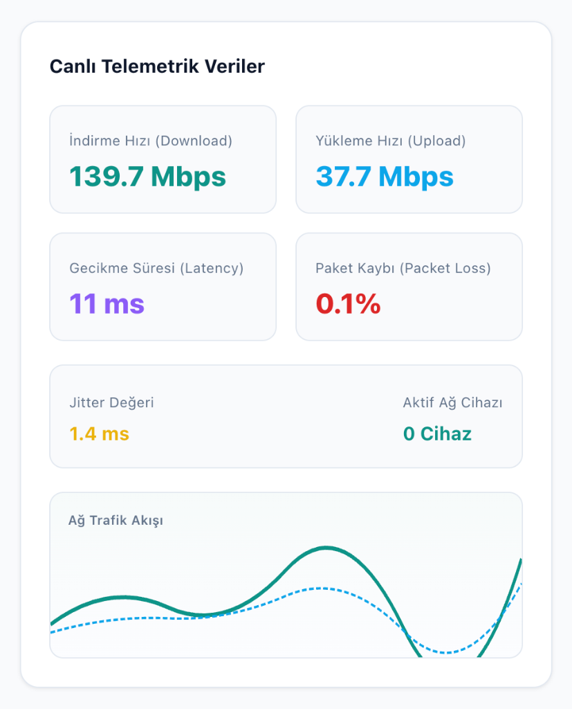
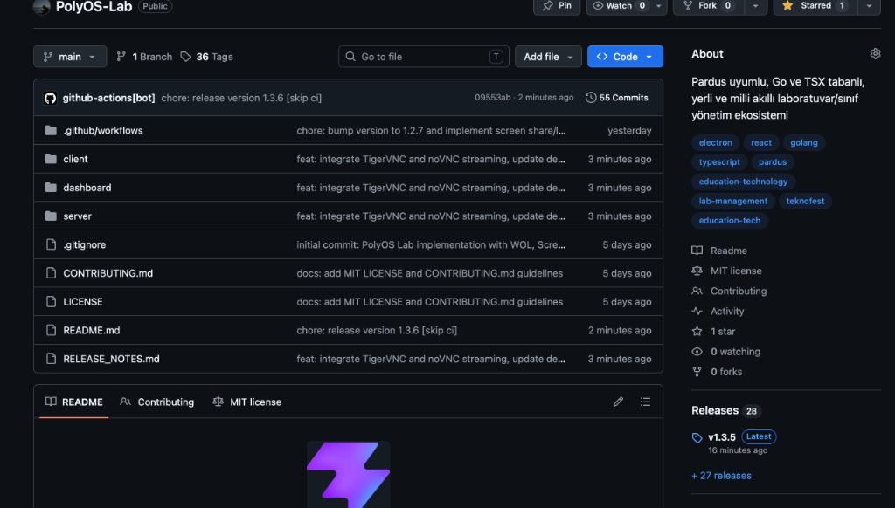
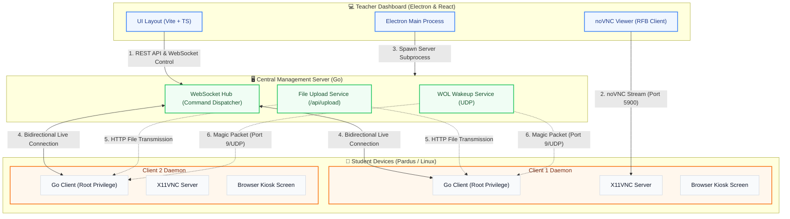

```text
####   ###  #     #   #  ###   ####      #      ###  #    
#   # #   # #     #   # #   # #          #         # #    
####  #   # #      ###  #   #  ###       #      #### #### 
#     #   # #       #   #   #     #      #     #   # #   #
#      ###  ####    #    ###  ####       ####   #### ####
```

<p align="center">
  <strong>Eğitim kurumları ve bilgisayar laboratuvarları için modern, güvenli ve anlık yönetim ekosistemi.</strong>
</p>

<p align="center">
  
  
  
</p>

<p align="center">
  
  
  
  
  
</p>

<p align="center">
  
  
  
  
  
</p>

<p align="center">
  <a href="#-nedir">Nedir?</a> •
  <a href="#-ekran-görüntüleri">Ekran Görüntüleri</a> •
  <a href="#-özellikler">Özellikler</a> •
  <a href="#-mimari-ve-yapı">Mimari Yapı</a> •
  <a href="#-kurulum">Kurulum</a> •
  <a href="#-yol-haritası">Yol Haritası</a> •
  <a href="#-lisans">Lisans</a>
</p>

---

## 🌟 Nedir?

**PolyOS Lab**, okul laboratuvarlarında öğretmenlerin öğrenci bilgisayarlarını canlı olarak izlemesini, uzaktan kontrol etmesini ve yönetmesini sağlayan modern, yüksek performanslı ve hafif bir laboratuvar yönetim ekosistemidir. 

Geleneksel hantal yönetim yazılımlarının aksine, Go dilinin sunduğu yerel hız ve eşzamanlılık (concurrency) avantajları ile React/Vite/Electron üçlüsünün esnek arayüz dinamiklerini birleştirir. Ürün %100 oranında **Pardus (Linux)** işletim sistemine uyumlu olacak şekilde geliştirilmiş ve test edilmiştir.

> [!NOTE]
> PolyOS Lab bir PolyOS ürünüdür — Pardus Okul Laboratuvar Yönetim ve Ödev Sistemi.

---

## 🖼️ Ekran Görüntüleri

### 🖥️ Öğretmen Kontrol Paneli - Genel Bakış
Aynı anda düzinelerce öğrenci istemcisini gerçek zamanlı (canlı yayın) olarak izleyin, tek tıkla toplu işlemler gerçekleştirin veya istemcileri yönetin.

<p align="center">
  
</p>

### 📁 Hızlı İşlemler & Dosya Transferi
Seçili öğrenci bilgisayarlarına veya tüm sınıfa sürükle-bırak yöntemiyle saniyeler içinde dosya gönderin, interneti/USB'yi kilitleyin ya da bilgisayarları uzaktan açıp kapatın.

<p align="center">
  
</p>

---

## ❓ Neden PolyOS Lab?

* **Pardus ve EBA Sınıfları İçin Tam Uyum:** Pardus ve diğer Debian tabanlı sistemler için sıfır yapılandırmayla çalışır.
* **Go Gücü ile Düşük Kaynak Tüketimi:** Arka planda minimum RAM ve CPU harcayarak eski bilgisayarlarda bile performans kaybı yaşatmaz.
* **Ultra Düşük Gecikmeli Ekran Paylaşımı:** Öğretmenin ekranını veya öğrencilerin ekranlarını noVNC tabanlı yenilikçi yapısı sayesinde gecikmesiz olarak aktarır.
* **Bütünleşik Sınıf Kontrolü:** Kilit ekranı, USB bloklama, internet engeli ve dosya gönderme gibi tüm araçlar tek noktada birleşir.

---

## 🚀 Özellikler

### 🖥️ Ekran İzleme ve Uzaktan Kontrol
* **Düşük Gecikmeli Canlı Yayın**: İstemcilerden sunucuya optimize edilmiş ekran görüntüleri akar.
* **noVNC Tabanlı Canlı Akış**: VNC protokolünü tarayıcı tabanlı noVNC kitaplığıyla entegre ederek harici istemci programı ihtiyacını ortadan kaldırır.
* **Fare ve Klavye Simülasyonu**: Tek tıklamayla uzak makinedeki fare koordinatlarını yüzdesel olarak hesaplar ve `xdotool` / CoreGraphics aracılığıyla anında simüle eder.
* **Pano (Clipboard) Senkronizasyonu**: Öğretmen panosundaki herhangi bir metni anında öğrenci bilgisayarının kopyalama hafızasına gönderir.

### 🔒 Güvenlik ve Odak Modu
* **Girdileri Kapat & Kilitle**: Tek tıkla tüm klavye/fare girdilerini `xinput` seviyesinde kapatır ve aşılması imkansız, tam ekran bir *"Bu Bilgisayar Kilitlendi"* uyarısı açar.
* **USB Depolama Engelleme**: İstemci cihazlarında `usb-storage` ve `uas` çekirdek (kernel) modüllerini kara listeye alarak USB belleklerin bağlanmasını engeller.
* **İnternet ve Web Filtresi**:
  - Tüm laboratuvarın internetini tek tıkla ağ seviyesinde kesip açabilir.
  - İstemcilerin `/etc/hosts` dosyasını manipüle ederek yasaklı web sitelerini sunucu üzerindeki özel `/blocked` uyarı sayfasına yönlendirir.

### ⚡ Hızlı Operasyonlar ve WOL
* **PolyOS Wake (Wake-on-LAN)**: Bağlanan tüm bilgisayarların MAC adreslerini kaydeder. Bilgisayarlar kapalı olsa bile Ethernet üzerinden sihirli paket (Magic Packet) göndererek topluca uyandırır.
* **Sürükle-Bırak Dosya Transferi**: İstediğiniz bir dosyayı istemci kartının üstüne sürükleyip bırakarak o öğrencinin Masaüstüne doğrudan aktarabilirsiniz.
* **Seçili Cihazlara Dosya Gönderme**: Gelişmiş "Dosya Gönder" penceresi ile seçilen 3-5 istemciye aynı anda toplu dosya aktarımı.

---

## 🏗️ Mimari Yapı

PolyOS Lab, modüler yapısı sayesinde esnek ve ölçeklenebilirdir. Aşağıda, sistemin bileşenleri arasındaki veri ve protokol akışını gösteren detaylı mimariyi inceleyebilirsiniz:



### 📁 Klasör Yapısı
* [**`server/`**](file:///Users/gok_emirhan/Documents/projelerim/Polyos-lab/server): Komut yönlendirme, dosya yükleme, WOL yayını ve WebSocket istemci yönetimini sağlayan Go sunucu kodları.
* [**`client/`**](file:///Users/gok_emirhan/Documents/projelerim/Polyos-lab/client): Öğrenci bilgisayarlarında yetkili modda çalışan, ekran yakalayan ve işletim sistemi komutlarını tetikleyen Go istemci kodları.
* [**`dashboard/`**](file:///Users/gok_emirhan/Documents/projelerim/Polyos-lab/dashboard): Öğretmenin kullandığı, canlı ekran önizlemelerini gösteren, toplu/tekil komut gönderen React & Electron masaüstü uygulaması.

---

## ⚙️ Kurulum ve Geliştirme

### Sistem Gereksinimleri
* **Öğrenci Bilgisayarı (Linux/Pardus)**: `xinput`, `scrot`, `xdotool`, `xclip`, `python3-tk`, `x11vnc`
* **Geliştirme Ortamı**: `Go 1.20+`, `Node.js 18+`

### 1. Sunucuyu Çalıştırın
```bash
cd server
go run main.go
```
* Sunucu Varsayılan Port: `8080`
* Dosya Transferi Yolu: `/uploads` (Kullanıcı yapılandırmasına göre dinamik olarak yönetilir)

### 2. Dashboard'u (Öğretmen Paneli) Çalıştırın
```bash
cd dashboard
npm install
npm run electron:dev
```

### 3. İstemciyi (Öğrenci İstemcisi) Başlatın
```bash
cd client
# Giriş cihazlarını (xinput) ve USB erişimini (modprobe) yönetmek için root yetkisi gereklidir:
sudo go run main.go
```

---

## 🗺️ Yol Haritası

- [x] Çoklu İstemci Canlı İzleme ve Uzaktan Yönetim
- [x] Ekran Kilitleme ve Tam Ekran Engelleyici Arayüzü
- [x] Sistem Seviyesinde USB Kilitleme / Açma
- [x] Wake-On-LAN Entegrasyonu (PolyOS Wake)
- [x] Öğretmen Ekranını Öğrencilere Yansıtma (Screen Share)
- [x] Cihazları Uzaktan Uyku Moduna Alma
- [x] Sürükle-Bırak Dosya Gönderme Sistemi
- [ ] Öğrenciler İçin Anlık Soru/Cevap ve Sınav Modu
- [ ] Ağ Bant Genişliği Limitleme

---

## 📄 Lisans

Bu proje **MIT** lisansı altında lisanslanmıştır. Daha fazla bilgi için `LICENSE` dosyasına göz atabilirsiniz.
